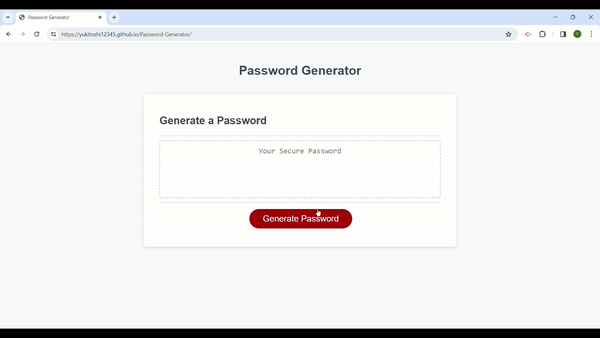

# Password Generator
Developed an interactive application that empowers employees to generate customised passwords based on their chosen criteria.

## Table of Contents

- [Objectives](#objectives)
- [Screenshot](#screenshot)
- [Output](#output)
- [Installation](#installation)
- [License](#license)

## Objectives
The following criteria has to be met:

- The user clicks a button to generate a new password.
- The user is presented with a series of prompts to define the criteria for their password.
- The user chooses a password length between 8 and 128 characters.
- The user selects whether or not to include lowercase letters, uppercase letters, numbers, and special characters in the password. 
- At least one character type must be selected.
- User input is validated to ensure that it adheres to the specified criteria.
- Upon completion of all prompts, a password is generated based on the selected criteria.
- The generated password is displayed to the user either through an alert or on the page.

## Video

## Output
Upon completing the password creation process, a secure password matching the specified criteria is generated and displayed to the user.

## Installation
The project was uploaded to [GitHub](https://github.com/) at the following repository:
[https://github.com/yukitoshi12345/Password-Generator](https://github.com/yukitoshi12345/Password-Generator)

You can access the deployed application with the GitHub Pages link:
[https://yukitoshi12345.github.io/Password-Generator/](https://yukitoshi12345.github.io/Password-Generator/)

## License
This project is licensed under the [MIT License](https://github.com/Yukitoshi12345/Password-Generator/blob/main/LICENSE).